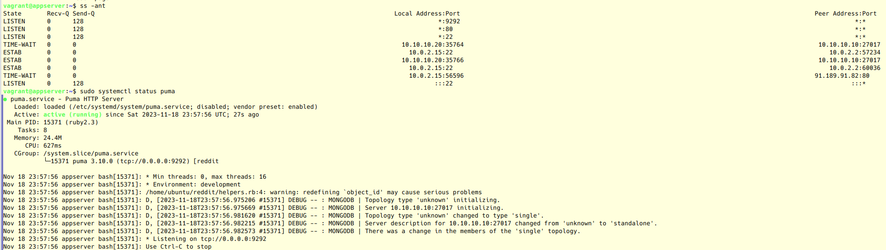

[](https://app.travis-ci.com/aasdhajkshd/infra)

# aasdhajkshd_infra
AAsdhajkshD Infra repository

## Содержание

* [Работа с ролями и окружениями Ansible](#hw12)
* [ansible-4 Разработка и тестирование Ansible ролей и плейбуков](#hw13)

## <a name="hw13">Разработка и тестирование Ansible ролей и плейбуков/a>

> <span style="color:red">INFO</span>
<span style="color:blue">Информация на картинках, как IP адреса или время, может отличаться от приводимой в тексте!</span>

#### Выполненные работы

Выполнена установка `sudo pacman -S extra/vagrant` и VirtualBox.

Выполнено описание описание локальной инфраструктуры и при запуске `vagrant up` возникла сразу ошибка.

Результат:

```output
Bringing machine 'dbserver' up with 'virtualbox' provider...
Bringing machine 'appserver' up with 'virtualbox' provider...
==> dbserver: Box 'ubuntu/xenial64' could not be found. Attempting to find and install...
    dbserver: Box Provider: virtualbox
    dbserver: Box Version: >= 0
The box 'ubuntu/xenial64' could not be found or
could not be accessed in the remote catalog. If this is a private
box on HashiCorp's Vagrant Cloud, please verify you're logged in via
`vagrant login`. Also, please double-check the name. The expanded
URL and error message are shown below:

URL: ["https://vagrantcloud.com/ubuntu/xenial64"]
Error: The requested URL returned error: 404

```

Решение использовать [зеркало](https://habr.com/ru/articles/735700/).
Скачали [образ](https://releases.ubuntu.com/16.04/ubuntu-16.04.7-server-amd64.iso):

```bash
export VAGRANT_DISABLE_VBOXSYMLINKCREATE=1
sudo echo -e "* 10.0.0.0/8 192.168.0.0/16\n* 2001::/64" >> /etc/vbox/networks.conf
sudo chmod go+r /etc/vbox/networks.conf
```

Лог *vagrant* deployment'а во вложении [README](ansible/README.md)

---

### Локальная разработка с Vagrant

```bash
vagrant destroy -f; vagrant up
vagrant provision dbserver
vagrant provision appserver
vagrant ssh appserver
telnet 10.10.10.10 27017
```

Для установки bundle в систему можно установить версию не ниже [1.16.1](https://github.com/express42/reddit/blob/monolith/Gemfile.lock):

```yaml
- name: Install gem bundler
  gem:
    name: bundler
    norc: false
    state: present
    user_install: false
    force: true
    version: 2.3.26
  become: true
```

Результат:


```output
PLAY RECAP *********************************************************************
dbserver                   : ok=11   changed=7    unreachable=0    failed=0    skipped=0    rescued=0    ignored=0

PLAY RECAP *********************************************************************
appserver                  : ok=29   changed=18   unreachable=0    failed=0    skipped=17   rescued=0    ignored=0
```


### Задание со *

Воспользуемся ранее устанавливаемым `jdauphant.nginx`




### Тестирование роли

Установка зависимостей `sudo pacman -S extra/molecule-plugins extra/molecule extra/python-pytest-testinfra python-vagrant`

Создание тестовой машины

```bash
molecule init scenario -d vagrant
```


```bash
molecule create
```


```bash
molecule login -h instance
molecule converge
molecule verify
```

В результате тесты прошли успешно


#### Задание со 'star'

В предыдущий раз для Travis-CI делал (VPN и евро карта требуется) и Slack подвязывал в Gitlab-CI, но продукт неактуален и ему замена Gitlab-CI, там фокус буду продолжать развивать.

---

## <a name="hw12">Работа с ролями и окружениями Ansible
#### Выполненные работы

1. Создана ветка **ansible-3**
2. Перенесены созданные плейбуки в раздельные роли и с помощью **ansible-galaxy** созданы заготовки
3. Внесены изменения в плейбуки db, app, deploy
4. Проверена работа ролей
5. Изменен **ansible.cfg** с указанием переменных окружения для сред **prod** и **stage**
6. Органиваны плейбуки директории *ansible*
7. Добавлена community роль на примере **jdauphant.nginx**
8. Проверена работа с окружениями, где добавлен **users.yml** плейбук с использованием **ansible-vault**
9. Проверяем функционал

#### Задание со 'star'
1. Для использования динамического инвентори был указан в **ansible.cfg** файл *inventory.json*
2. Для прохожденим валидации в **travis** файл *inventory.json* скопирован в *inventory.sh*

#### Задание со '2star'
1. Добавлен файл **.travis.yml**
2. Выполнил регистрацию на с учетной записью в GitHub https://www.travis-ci.com/
3. Добавлена загрузка и проверка:
```
packer validate
terraform validate
tflint для окружений stage и prod
ansible-lint для плейбуков Ansible
```
1. Добавлен в **README.md** badge со статусом build'а Trial Plan (We are unable to start your build at this time. You exceeded the number of users allowed for your plan. Please review your plan details and follow the steps to resolution.)
2. Зеркало Yandex Cloud временно недоступно. https://cloud.yandex.ru/docs/tutorials/infrastructure-management/terraform-modules. Возможно в следствии этого terraform init не инициализируется на платформе travis-ci.com, хотя локально .travis.yml проходит успешно все пункты тестирования репозитория. Правильно для тестирования нужно создавать программу тестирования, например, на python или других языках, а не простыми прямыми командами.
2. Репозиториый клонировал в локальный aasdhajkshd/infra.git и для badge'а выполнил тестирование в Travis CI. Файл .travis.yml перенесён в текущий репозиторий для демонстрации к заданию.
3. TryTravis README.md гласит: This package is no longer maintained. Do not use it. https://github.com/sethmlarson/trytravis
